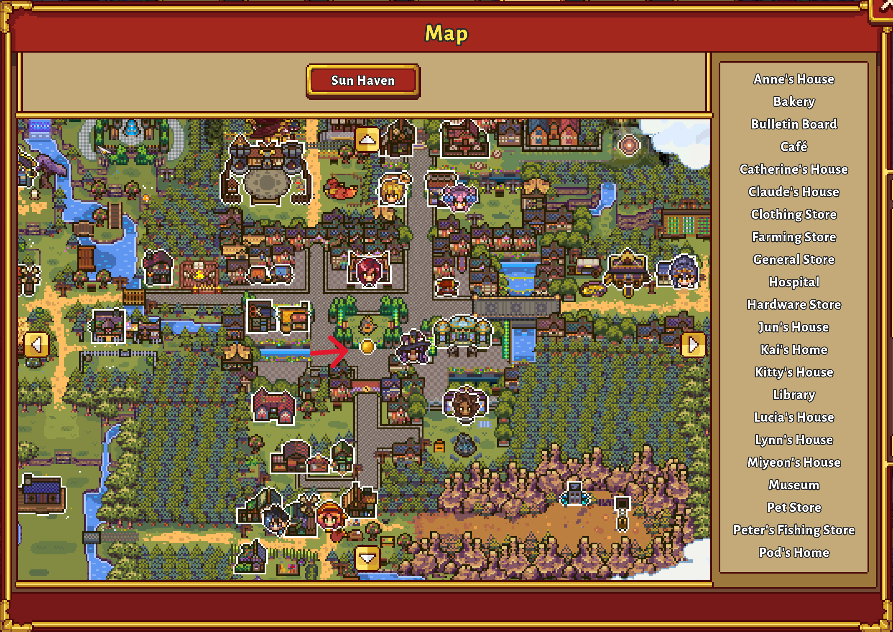

# Sun Haven Map Player Dot Fix

A small **BepInEx** mod that restores the missing player position dot on the world map (M) in Sun Haven 3.0+.

This is a lightweight workaround for a UI issue introduced in recent updates where the player marker no longer appears on the map.



---

## Features
- Restores the player dot on the world map
- Preserves the original hover tooltip
- Prevents duplicate or flashing player markers
- Minimal performance impact

---

## Requirements

- **[Sun Haven (Steam / Windows)](https://store.steampowered.com/app/1432860/Sun_Haven/)**
- **[BepInEx 5 (x64)](https://www.nexusmods.com/sunhaven/mods/30)**

⚠️ This mod requires BepInEx. It will not work without it.

---

### Installation
1. Install [BepInEx 5 (x64)](https://www.nexusmods.com/sunhaven/mods/30) for [Sun Haven](https://store.steampowered.com/app/1432860/Sun_Haven/).
2. Download the latest release from the Releases page.
3. Extract the folder into your Sun Haven install directory.

You should end up with:
```text
Sun Haven/
└─ BepInEx/
 └─ plugins/
  └─ SunHavenMapPlayerDotFix/
   └─ SunHavenMapPlayerDotFix.dll
   └─ README.txt
```

4. Launch the game.

---

## Uninstall

Delete:
BepInEx/plugins/SunHavenMapPlayerDotFix/

---

## Notes
- Minor position offsets may vary slightly in small sub-areas due to how Sun Haven scales map sprites.
- This mod does not modify any game files and is safe to remove at any time.
- This mod will probably not be needed for long as the Developers will hopefully fix it.

## License
MIT
